# Découverte du M5Stack

_Sébastien Colas_

Je suis formateur en informatique depuis bientôt 20 ans. Au cours de ma carrière j’ai pu dispenser des cours sur de nombreuses technologies : Serveur d’applications JavaEE, SOA, Services Web, Linux, Virtualisation, API led Connectivty et Application Network. Sans oublier les langages : Java, PHP, Python, JavaScript... Je suis aussi auteur pour « Linux Pratique » et « Hackable » autour des sujets Raspberry Pi, Arduino, IoT, électronique digitale et bien sûr Linux.
http://colas.sebastien.free.fr/

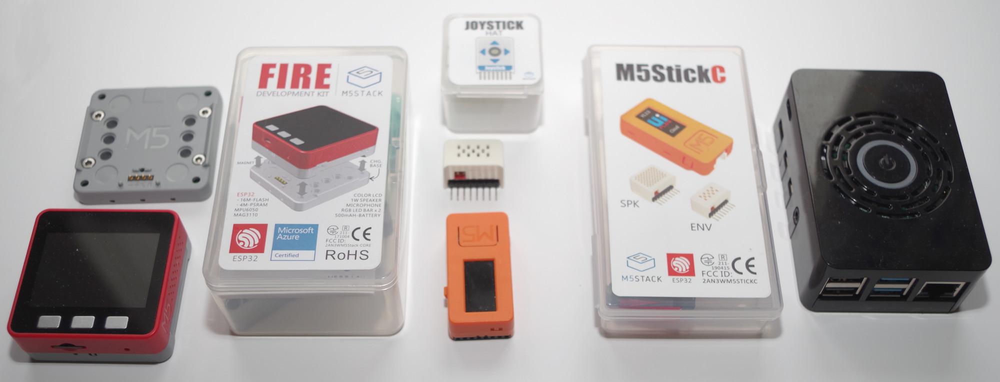


## Introduction

Dans cet article nous allons prendre en main un M5Stack ainsi qu’un M5StickC. Après avoir décrit pourquoi ces deux modèles permettent d’entrer en douceur dans le monde du développement sur IoT (Internet of Thing, en français l’Internet des objets), nous aborderons les outils de développement : UIFlow l’outil de développement graphique ainsi que l’Arduino IDE nous permettant de développer en C.

## 1. Le matériel

Avant toute chose, tout ce qu’il faut savoir à propos tu M5Stack se trouve sur le site officiel :
https://m5stack.com

Un des gros avantages des matériels M5Stack est qu’il n’y a pas besoin de sortir sont fer à souder pour commencer à faire du prototypage. En effet de base le M5Stack possède un bon nombre de composants embarqués. 

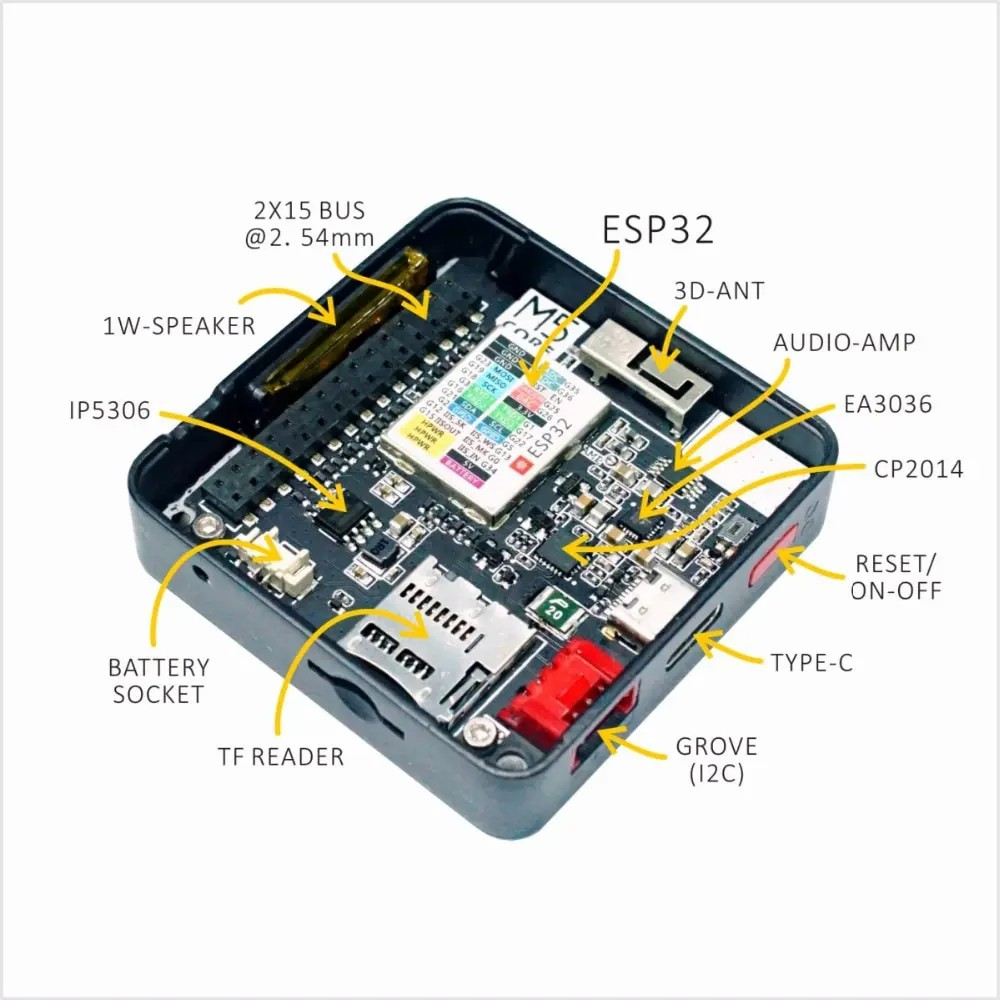

Regardons ce que nous propose le M5Stack (version Basic) :
- Un haut parleur 1 Watt ainsi que sa puce d’amplification
- Un ESP32 comprenant un processeur 240MHz dual core, 520Ko de SRAM, Wi-Fi et Bluetooth
- Un bouton (rouge) pour réinitialisation/marche/arrêt
- Un lecteur Micro SD (attention limité à 16 Go)
- Une batterie LiPo ainsi qu’une puce IP5306 pour surveiller le niveau de charge
- Un connecteur USB type C permettant de charger les programmes ainsi que la recharge la batterie
- Un écran LCD couleur 320x240
- Trois boutons en façade

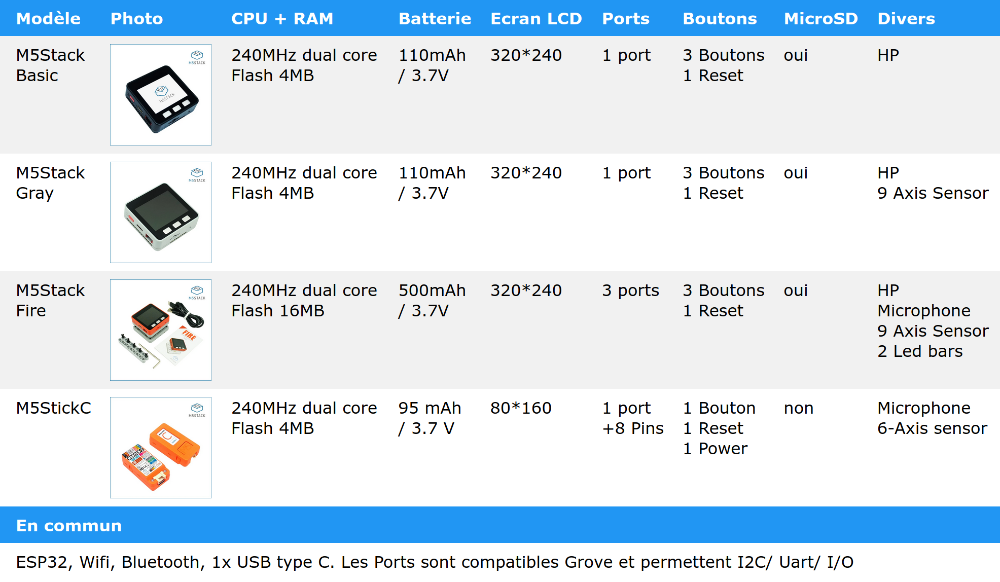

La première chose à savoir c’est comment allumer et éteindre les différents modèles :
- Pour allumer le M5Stack il faut appuyer une fois sur le bouton rouge. Pour l’arrêt il faudra appuyez deux fois sur le bouton. 
- Pour allumer le M5StickC il faut appuyer une fois sur le bouton situé à côté du connecteur USB. Pour l’arrêt il faudra appuyer 6 secondes sur le bouton.
Les prix :
- M5Stack basic : 35€
- M5Stack Fire : 65€
- M5StickC : 25€

> Où acheter votre M5Stack ?
> - Sur certains sites d’electronique : https://www.gotronic.fr/
> - Sur le site officiel: https://m5stack.com

## 2. Idéal pour l’IoT

Le M5Stack nous permet très facilement de rajouter des modules électroniques en fonction de nos besoins. Ses modules s’enfichent par le dessous du composant, on dit qu’il est « stackable ».

Voici une sélection de modules pour M5Stack :

| Module M5Stack  | Description |
|-----------------|-------------|
| USB             | Le M5Stack devient Hôte USB, on peut donc y connecter n’importe quel périphérique USB
| GSM             | Ajouter au M5Stack les fonction d’un téléphone mobile
| GPS             | Ajouter un GPS au M5Stack
| Battery         | Ajouter une batterie supplémentaire pour gagner en autonomie. Plusieurs modules Battery peuvent être utilisés en même temps pour augementer encore plus l’autonomie du M5Stack
| SERVO           | Ce module permet au M5Stack de piloter jusqu’à 12 servo moteurs
| Stepmotor       | Piloter 3 moteurs pas à pas à l’aide de votre M5Stack
| LEGO+           | Piloter 4 moteurs Lego Mindstorm à l’aide de votre M5Stack

Le M5Stick quant à lui n’est pas « stackable » mais on peut aussi étendre ses fonctionnalités en rajoutant un modules appelé « Hat ». De nombreux modules « Hat » existent. Un connecteur 8 broches est prévu pour connecter ces modules « Hat ».

Voici une sélection de Hat pour M5StickC :
| M5StickC Hat | Description |
|--------------|-------------|
| PowerC       | Le M5Stick gagne en autonomie grace à ce module permettant d’ajouter 2 batteries rechargeables 16340
| 18650C       | Le M5Stick gagne en autonomie grace à ce module contenant une batterie rechargeable 18650
| JoyC         | Transformer le M5StickC en Joystick Wireless grâce à ce module embarquant une batterie rechargeable 16340
| RoverC       | Transformer le M5StickC en robot roulant grâce à ce module 18350 embarquant une batterie rechargeable 18350
| 8Servos      | Piloter 8 servo moteurs à l’aide de ce module, il faudra rajouter une batterie 16340 pour alimenter les servo moteurs.
| Joystick     | Ajouter un joystick à votre M5StickC.
| Yun          | Hat en forme de nuage idéal pour transformer votre M5StickC en station météo. Capteurs inclus : température, humidité, pression.
| Thermal Camera | Votre M5Stick devient une caméra thermique de faible résolution 32x24

Comme on peut le constater, le M5StickC seul ne possède pas une grande autonomie (Quelques heures seulement en fonction des utilisations), c’est pourquoi de nombreux Hat proposent l’ajout de batteries.

Les modèles M5Stack et M5Stick possèdent au moins un port d’extension compatible Grove permettant de connecter des composants électroniques via I2C, Uart et GPIO.

# 3. Programmation avec UIFlow

## 3.1 Installation de UIFlow via M5Burner

A partir du site de téléchargement https://m5stack.com/pages/download téléchargeons le M5Burner. Attention sur certain OS il faut installer un driver USB avant de pouvoir lancer le M5Burner. (CP2104 Driver sur la page de téléchargement) Une fois lancé le Burner nous permet de sélectionner le programme à installer. Sélectionnons la dernière version 1.4.5.1 de UIFlow qui est compatible M5Stack et M5StickC. Les versions plus récentes supportent uniquement le M5Stack. Une fois téléchargé nous pouvons envoyer notre programme à notre M5Stack en cliquant sur Burn, n’oubliez pas auparavant de spécifier vos information Wifi. (voir capture d’écran)

                  


Une fois installé le programme se lance automatiquement, on nous propose un rapide mode d’emploi ainsi que la découverte des fonctionnalités du M5Stack (haut parleur, microphone, gyroscope, RGB bar…)

## 3.2  Utilisation de UIFlow

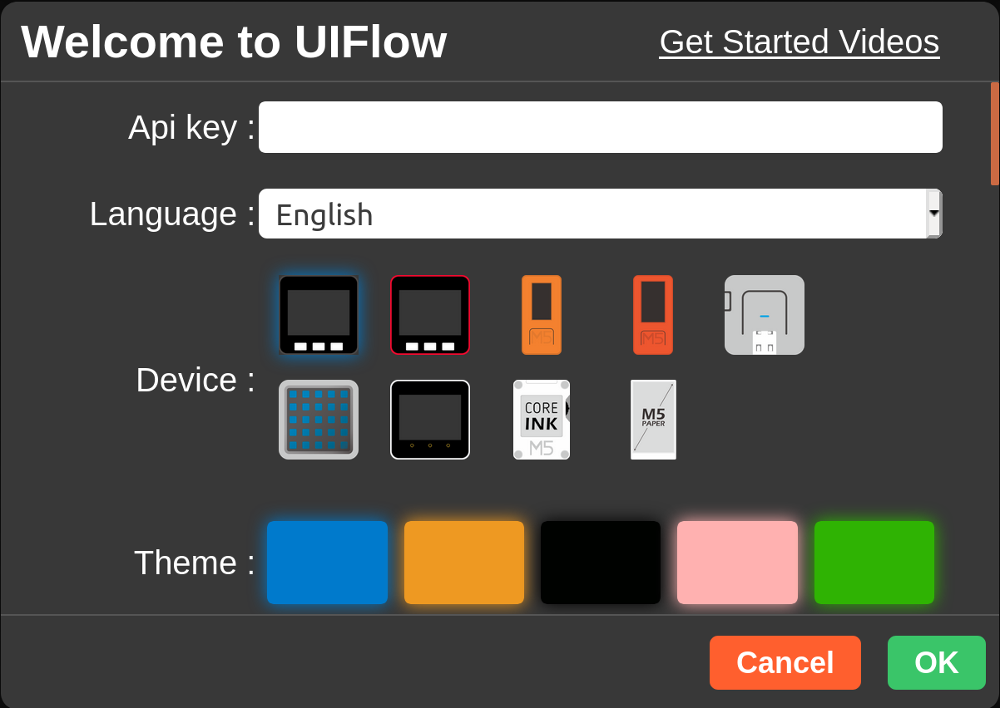

L’étape suivante consiste à connecter l’interface de développement UIFlow à notre M5Stack. Il y a deux possibilités pour accéder à UIFlow : en ligne grâce à L’URL https://flow.m5stack.com/ ou bien grâce à l’IDE disponible sur le site de téléchargement. L’outil nous demande « l’Api key » pour pouvoir déployer notre application  sur notre M5Stack. Pour obtenir cette information il faut redémarrer le M5Stack en appuyant sur le bouton rouge puis rapidement appuyer sur le premier bouton « upload ».

L’étape suivante consiste à connecter l’interface de développement UIFlow à notre M5Stack. Il y a deux possibilités pour accéder à UIFlow : en ligne grâce à L’URL https://flow.m5stack.com/ ou bien grâce à l’IDE disponible sur le site de téléchargement. L’outil nous demande « l’Api key » pour pouvoir déployer notre application  sur notre M5Stack. 

Si vous avez tester les application pré-installé pour retourner sur le menu affichant « l’API key » il  faut redémarrer le M5Stack en appuyant sur le bouton rouge puis rapidement appuyer sur le bouton du milieur (celui situé sous les deux points).

Pour le moment UIFlow ne permet pas de développer en Français, nous allons donc utiliser l’interface en anglais.

## 3.3 Programmation « Communication en MQTT »

Je vous propose 2 programmes appelés Flows. Un pour le M5Stack et un pour le M5StickC. Le but principal de ces Flows est de communiquer en asynchrone avec un gestionnaire de message via le protocole MQTT (Message Queuing Telemetry Transport). Ce protocole, fréquemment utilisé dans l’IoT, permet la diffusion d’information, on parle de communication en mode éditeur/abonné. (En anglais : publish/subscribe ou encore Pub/Sub). Nous pouvons utiliser l’implémentation du groupe Apache nommée MosQuiTTo. Apache met à notre disposition un serveur à l’adresse suivante : mqtt.eclipse.org:1883. Sur notre schéma le M5StickC c’est abonné au message. Le M5Stack envoie un message qui est diffusé par le serveur MQTT aux abonnés, en l’occurrence notre M5StickC. Il s’agit d’un schéma simplifié. Comme vous ne disposez peut-être pas de plusieurs M5Stack, l’émetteur du message est aussi un abonné. Il recevra donc son propre message.

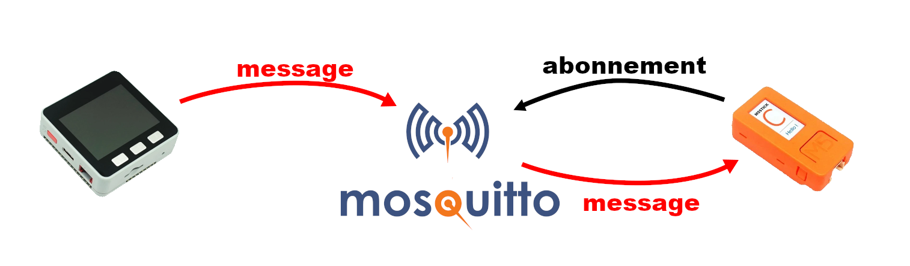

Voici le code pour notre M5Stack :

```
Setup

Set screen brightness 20

set 		client id "Programmez₂"

server		"mqtt.eclipse.org"
port		1883
user		""
password	""
keepalive	300
mqtt start
Speaker.volume 0.1

mqtt subscribe "/topic/M5Stack" with topic_data

  Label 	message 	show 	get topic_data
  Label 	batterie 	show 	get Battery Level
  play tone 	Hight A 	for 	1/2 beat
  Http Request
  Method 	GET
  URL 		"http://worldtimeapi.org/api/timezone/cet"
  Headers 	create map
  Data 		create map
  Success 	Label 		time 	show 	get key "datetime" in map loads json Get Data
  Fail 		Label 		time 	show 	"Erreur"

Button		A	wasPressed
  publish topic	"/topic/M5Stack"	msg	"M5Stack Button A"

Button		B	wasPressed
  publish topic	"/topic/M5Stack"	msg	"M5Stack Button B"

Button		C	wasPressed
  publish topic	"/topic/M5Stack"	msg	"M5Stack Button C"

Voici le code pour notre M5StickC :

Setup
Set screen brightness 20

set 		client id "Programmez_1"

server		"mqtt.eclipse.org"
port		1883
user		""
password	""
keepalive	300


mqtt subscribe "/topic/M5Stack" with topic_data
  Label 	message 	show 	get topic_data

Button		A	wasPressed
  publish topic	"/topic/M5Stack"	msg	"M5Stick Button A"

Button		B	wasPressed
  publish topic	"/topic/M5Stack"	msg	"M5Stick Button B"
```

## 3.4 Installer un serveur Mosquitto

Dans les Flows précédents nous avons utilisé le serveur MQTT proposé par apache (MosQiTTo). Nous pouvons nous aussi installer notre propre serveur MosQiTTo sur un serveur  Rapsberry Pi en tapant la commande :
sudo apt-get install mosquitto

Ensuite il nous suffira de remplacer dans notre code : mqtt.eclipse.org par l’adresse IP de notre Rasperry Pi. Attention UIFlow ne reconnaît pas le protocole de découverte Bonjour.  Donc impossible de prendre pour adresse : raspberry.local

## 3.5 Programmation « Météo avec Hat YUN »

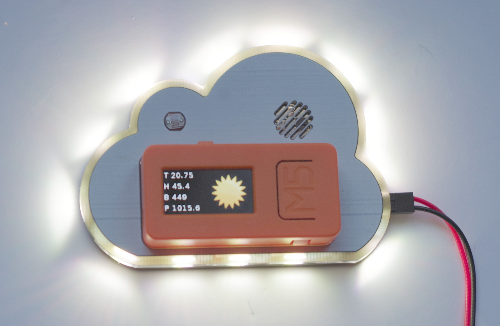

Dans ce deuxième programme UIFlow nous allons utiliser le M5StickC et le Hat YUN. Ce composant est clairement adapté au développement d’une application météorologique.
Nous allons donc développer le Flow suivant :
- Connection au Wifi
- Récupération toutes les 5 minutes des prévisions météos grâce à OpenWeatherMap
- Affichage d’une image réprésentant la prévision météo dans les heures à venir
- Eclairage du Hat pour renforcer l’image (par exemple si un grand soleil est annoncé nous eclairerons notre hat en jaune)
- Affichage toutes les secondes des informations fournis pas le Hat : température, humidité, luminosité, pression atmosphérique

Pour pouvoir utiliser le service OpenWeatherMap, nous devons obtenir une clef d’accès APPID à l’adresse suivante : https://home.openweathermap.org/users/sign_up (Dans le code suivant il faudra remplavec XXX par votre clef).  Nous devons aussi récupérer le code de notre ville grace à la liste que l’on peut télécharger ici : http://bulk.openweathermap.org/sample/city.list.json.gz (dans le code suivant il faudra remplacer YYY par le code ville).


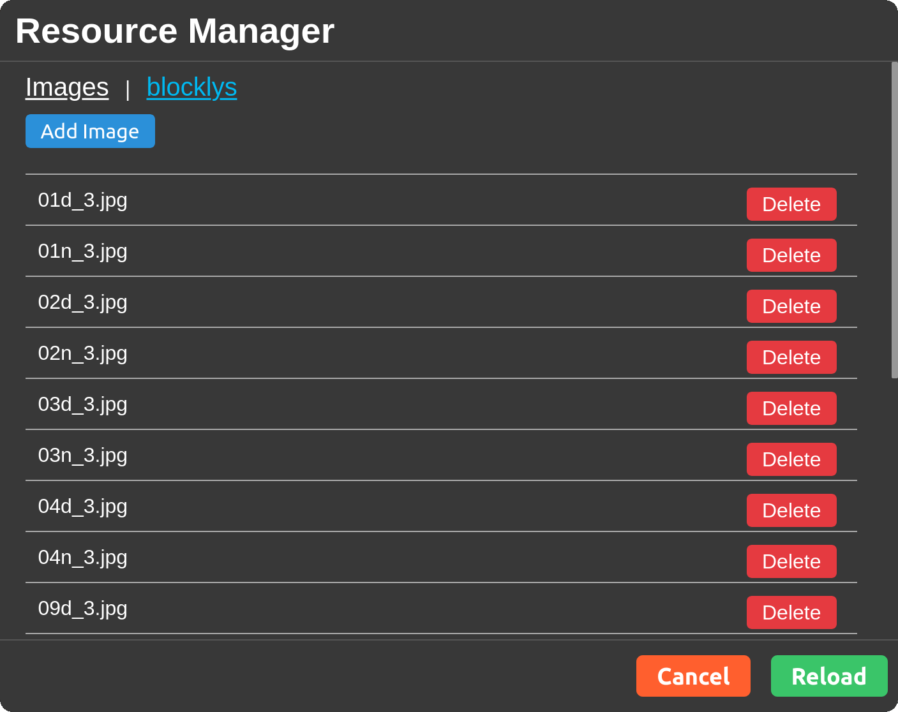
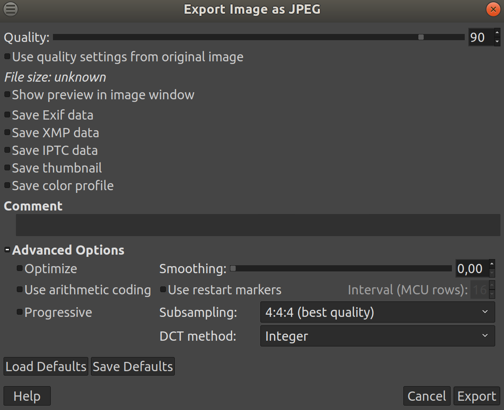

Il faut ensuite charger les images météo dans notre M5StickC par l’intermédiaire du « Resource Manager ». Le bouton se trouve en haut à droite de l’interface. (voir capture d’écran) Ensuite nous pouvons envoyer notre image au format jpg ou bpm. Ici nous allons choisir une image de soleil de 80x80 au format jpg. Toutes les options JPEG ne sont pas supportéss, désactivons donc toutes les options lors de la création du fichier. (voir capture d’écran gimp)

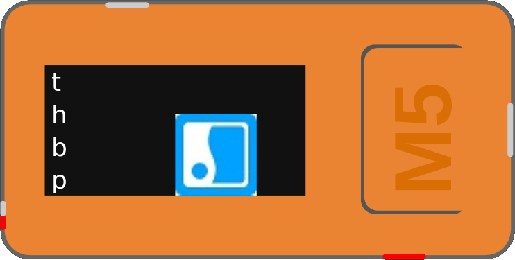

Nous pouvons placer notre image : image0 et nos labels : t,h,b,p (resp : température, humidité, brighness : luminosité , pression)

Il ne nous reste plus qu’a écrire notre programme :

```
Setup
wifi connect (log in lcd true)
Set Screen backgroundColor « black »
repeat while true
do
  Http Request
  Method GET
  URL http://api.openweathermap.org/data/2.5/forecast?id=XXX&APPID=YYY&units=metric

  Headers
  Data
  Success 
    set data to Get Data
    set list to make list from text data with delimiter « , »
    set icon in list get #36
    set list to make list from text icon with delimiter « " »
    set icon in list list get #4
    if icon = « 01d »
    do
      set image0 image 01d.jpg
      set hat all RGB color « yellow »
    if icon = « 01n »
    do
      set image0 image 01n.jpg
      set hat all RGB color « black »
…
  Fail
  repeat 300 times
  do
    Label p show « P » + Get hat yun Pressure
    Label h show « H » + Get hat yun humidity
    Label t show « P » + Get hat yun temperature
    Label b show « P » + Get hat yun Brightness
    Wait 1s
```

Le code a été tronqué pour ne montrer que les conditions météos 01d et 01n (respectivement beau temps de jour, beau temps de nuit), il faudra bien sûr que nous codions tous les cas. La liste des valueurs possibles se trouve ici : https://openweathermap.org/weather-conditions.

OpenWeatherMap nous retourne des information JSON, malheureusement faute de documentation le block de lecure JSON est unitilisable pour le moment. Nous avons donc dû biaisé en créant une liste avec comme délimiteur la virgule pour récupérer le code de condition météo.


# 4. Programmation avec Arduino IDE

La majeure partie des composants IoT supportent le langage C. Un gros avantage des M5Stack c’est qu’ils sont compatibles avec Arduino. Avant de pouvoir programmer nous allons donc devoir configurer notre Arduino IDE.

## 4.1 Installation de Arduino IDE

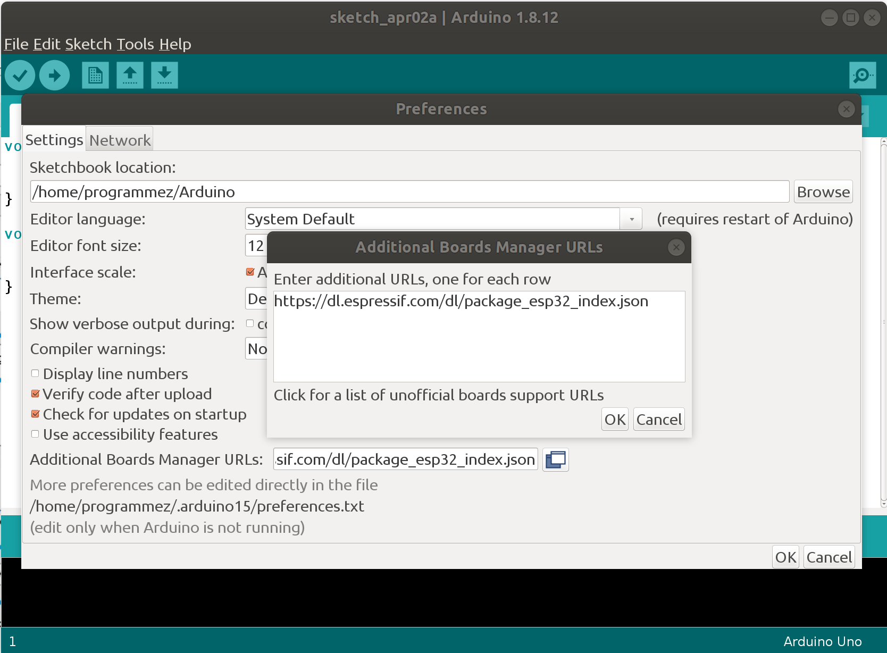
L’outil de développement est disponible en téléchargement à l’URL suivante : https://www.arduino.cc/en/Main/Software (Il existe aussi une version Web)
Les M5Stack intègre un ESP32 il nous faut donc ajouter le support de l’ESP32 à notre IDE. Cliquons sur File / Preferences dans le champs « Additional Boards Manager URLs » il faut saisir : 
https://dl.espressif.com/dl/package_esp32_index.json (voir capture d’écran)

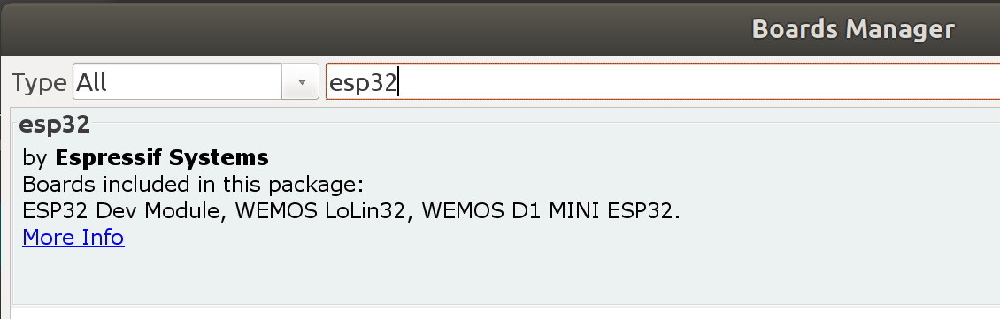
Il faut maintenant activé le support de l’ESP32. Cliquons sur Tools / Board / Board Manager... puis saisir ESP32 et intaller le composant.

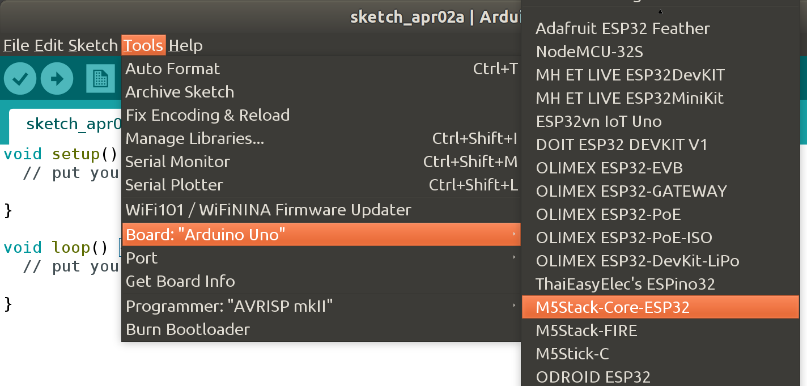
Il ne nous reste plus qu’à faire les dernier réglages :
- déclarer le « Board » à utiliser (sur la capture d’écran M5Stack-Core-ESP32)
- la vitesse de comunication « Upload speed » ( 1500000)
- spécifier le « Port » de communication (par exemple /dev/ttyUSB0)

## 4.2 Installation des Bibliothèques
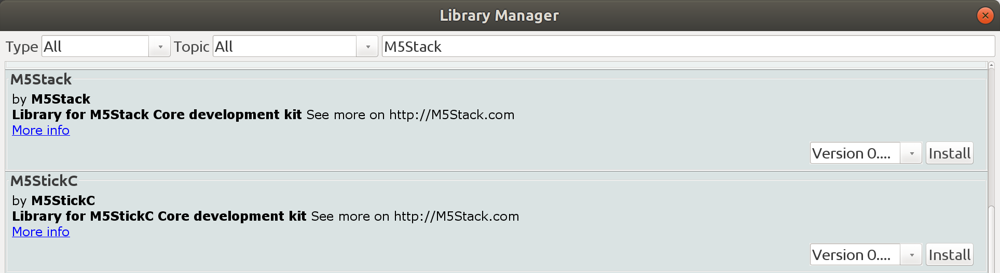
Nous allons maintenant télécharger les bibliothèques dont nous avons besoin. Tout d’abord les biblothèques M5Stack et M5Stick. (voir capture d’écran)
Cliquons sur Sktech / Include library / Manage Librairies… Sélectionnons M5Stack et M5StickC.

## 4.3 Programmation « cliqueur bluetooth »

Je vous propose dans ce premier projet en C de transformer notre M5Stick en « cliqueur bluetooth » à utiliser lors de nos futures présentations. 
Le principe de fonctionnement est donc le suivant :
- Connexion Bluetooth, notre « cliqueur » sera vue comme un clavier
- Lorsque l’on clique sur le bouton A, envoyer le fait qu’on appuie sur la flèche du bas (pour faire défiler notre présenation) et afficher un triangle vert sur l’écran LCD
- Lorsque l’on clique sur le bouton B, envoyer le fait qu’on appuie sur la flèche du haut (pour faire défiler notre présenation) et afficher un triangle rouge sur l’écran LCD

Pour commencer téléchargeons une bibliothèque pour simuler notre clavier BlueTooth :
https://github.com/T-vK/ESP32-BLE-Keyboard

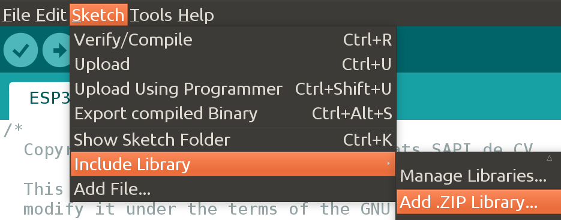
Ajoutons la bibliothèque :sktech / Include library / Add .zip Librairy… 

Ci-dessous le code de notre programme :

```
include <BleKeyboard.h>
#include <M5StickC.h>
/* #include <M5Stack.h> */

BleKeyboard bleKeyboard("Clicker Bluetooth","Programmez",100);

void setup() {
  M5.begin();
  Serial.begin(115200);
  Serial.println("Starting BLE work!");
  bleKeyboard.begin();
  M5.Axp.ScreenBreath(10);
/*  M5.Lcd.setBrightness(100); */
}

boolean redrawA = true;
boolean redrawB = true;
const int triangles[2][6] = {{20,70,60,70,40,30},{20,80,60,80,40,120}};

void draw_triangle(boolean pressed, int t,int color, boolean *redraw)
{
  if (pressed)
  {
    M5.Lcd.fillTriangle(triangles[t][0],triangles[t][1],triangles[t][2],
                        triangles[t][3],triangles[t][4],triangles[t][5],color);
  }
  else
  {
    if (*redraw)
    {
      M5.Lcd.fillTriangle(triangles[t][0],triangles[t][1],triangles[t][2],
                          triangles[t][3],triangles[t][4],triangles[t][5],BLACK);
      M5.Lcd.drawTriangle(triangles[t][0],triangles[t][1],triangles[t][2],
                          triangles[t][3],triangles[t][4],triangles[t][5],color);
      *redraw=false;
    }
  }
}
void loop() {
  draw_triangle(M5.BtnA.read(),0,GREEN,&redrawA);
  draw_triangle(M5.BtnB.read(),1,RED  ,&redrawB);

  if(bleKeyboard.isConnected())
  {
    if (M5.BtnA.wasPressed())
    {
      Serial.println("Sending KEY_DOWN_ARROW");
      bleKeyboard.write(KEY_DOWN_ARROW);
      redrawA = true;
    }
    if (M5.BtnB.wasPressed())
    {
      Serial.println("Sending KEY_UP_ARROW");
      bleKeyboard.write(KEY_UP_ARROW);
      redrawB = true;
    }
  }
  delay(100);
}
```

Intéressons nos aux fonctionnalités relatives à notre M5Stack :
- `#include <M5StickC.h>` Nous déclarons l’utilisation de la bibliothèque
- `M5.begin();` Initialisation de notre M5StickC
- `M5.Axp.ScreenBreath(10);` Spécifions la luminosité de notre afficheur LCD. Attention cette commande est spécifique au M5StickC, pour un M5Stack il faudra utiliser la commande `M5.Lcd.setBrightness(100);`
- `M5.Lcd.fillTriangle(...); M5.Lcd.drawTriangle(...)` Fonctions permettant d’afficher des triangles sur l’écran LCD
- `M5.BtnA.wasPressed();` Fonction permettant de détecter que l'on a appuyé sur un bouton

> Note de l’auteur : Après une recherche sur internet il semble que je ne sois pas le premier à avoir penser à transformer le M5Stack en « cliqueur bluetooth » https://programresource.net/2020/04/09/3244.html

## 4.4 Programmation « Pilotage de la Batmobile Lego »


Je vous propose dans ce second projet en C le pilotage de la Batmobile Lego à l’aide de notre M5StickC auquelle on aura ajouter le Hat Joystick.
 
Le principe de fonctionnement est donc le suivant :
- Connexion Bluetooth, notre M5Stick va piloter le Hub Lego
- Récupération de l’état du joystick : x,y,bouton
- Pilotage des moteurs attachés sur les ports A et B
- Si le bouton est appuyé changement de la couleur de la led Lego


Nous allons maintenant télécharger une bibliothèque supplémentaire : Legoino (voir capture d’écran)
Cliquons sur `Sktech / Include library / Manage Librairies…` Sélectionnons `Legoino`.


Premier problème : le Joystick Hat ne semble pas être pas de très bonne qualité. Comme on peut le voir sur le schéma nous allons éviter de prendre les valeurs lorsque le Joystick est en buté (zone rouge) car la valeur retournée est systématiquement -128. De même lorsque le Joystick est au repos les valeurs en x et y ne sont pas toujours à zéro. Nous allons donc définir une zone morte (zone où il ne se passera rien) avec comme intervale  -40 < x <+40 et -20 < y < 20. Sur le schéma il s’agit de la zone en vert. Il nous restera donc toute une zone de travaille, en bleue sur le schéma. Dans cette zone nous activerons les moteurs du légo en mode tout ou rien avec une vitesse de 80 sur un maximum de 100.

Second problème : les bibliothèques Legoino et M5StickC ne sont pas compatibles. En effet les couleurs sont définies dans ces deux bibliothèques avec les même noms ce qui génère un problème de compilation. 
Nous allons donc modifier la déclaration des couleurs dans la bibliothèque Legoino, pour cela modifions la définition des couleurs dans le fichier `Lpf2Hub.h` se trouvant dans le répertoire `Arduino/libraries/Legoino/src/`

```
typedef enum Color
{
  LEGO_BLACK = 0,
  LEGO_PINK = 1,
  LEGO_PURPLE = 2,
  LEGO_BLUE = 3,
  LEGO_LIGHTBLUE = 4,
  LEGO_CYAN = 5,
  LEGO_GREEN = 6,
  LEGO_YELLOW = 7,
  LEGO_ORANGE = 8,
  LEGO_RED = 9,
  LEGO_WHITE = 10,
  LEGO_NONE = 255
};
```

Voici maitenant le code de notre programme : 

```
#include <M5StickC.h>
#include <PoweredUpHub.h>
#include <Wire.h>
#define JOY_ADDR 0x38

int8_t x_data,y_data,button_data;

PoweredUpHub myHub;
PoweredUpHub::Port _portA = PoweredUpHub::Port::A;
PoweredUpHub::Port _portB = PoweredUpHub::Port::B;

boolean powerup_ok=false;

void setup() {
  // initialize the display
  M5.begin();
  Wire.begin(0, 26, 100000);
  


}

void loop() {  
  powerup_ok = myHub.isConnected();
  Wire.beginTransmission(JOY_ADDR);
  Wire.write(0x02); 
  Wire.endTransmission();
  Wire.requestFrom(JOY_ADDR, 3);

  if (!powerup_ok)
  {
    if (myHub.isConnecting()) {
      myHub.connectHub();  
    }
  }
  else  
    if (Wire.available()) {
      x_data = Wire.read();
      y_data = Wire.read();
      button_data = !Wire.read();

      if (button_data) {
          myHub.setLedColor(LEGO_RED);
          
      }
      else {          
          myHub.setLedColor(LEGO_GREEN);                   
      }  

      
      if (x_data != -128)
        if (x_data > 40)
        {
          myHub.setMotorSpeed(_portA, -80);
          myHub.setMotorSpeed(_portB, -80);
        }
        else
        if (x_data < -40)
        {
          myHub.setMotorSpeed(_portA,  80);
          myHub.setMotorSpeed(_portB,  80);        
        }
        else
          if (y_data != -128)
            if (y_data > 20)
            {
              myHub.setMotorSpeed(_portA,  80);
              myHub.setMotorSpeed(_portB, -80);
            }
            else
            if (y_data < -20)
            {
              myHub.setMotorSpeed(_portA, -80);
              myHub.setMotorSpeed(_portB,  80);        
            }
            else
            {
              myHub.setMotorSpeed(_portA,  0);
              myHub.setMotorSpeed(_portB,  0);                
            }      
    }
  delay(100);  
}
```

Regardons de plus prêt les fonctionnalités intéressantes :
- `#define JOY_ADDR 0x38` Notre Hat Joystick communique en I2C dont l’adresse est `0x38`
- `PoweredUpHub myHub;` Notre BatMobile est piloté par un Hub PowereUp que nous déclarons ici
- `PoweredUpHub::Port _portA = PoweredUpHub::Port::A;` Spécifions les port PowereUp que nous voulons utiliser. Nous utiliserons les ports A et B pour piloter les moteurs.
- `myHub.init();` Intialisons notre Hub
- `Wire.beginTransmission(JOY_ADDR); Wire.write(0x02);  Wire.endTransmission();` Ces 3 fonctions ont pour but d’acquérir l’état du JoyStick en I2C.
- `Wire.requestFrom(JOY_ADDR, 3);`  Demandons l’était sur JoyStick codé sur 3 octets : la position en x, la position en y, l’état du bouton
- `x_data = Wire.read(); y_data = Wire.read(); button_data = !Wire.read();` Récupérons les informations. L’état du bouton est à true
- `myHub.setMotorSpeed(_portA,  80);` Cette fonction permet modifier la vitesse attaché au moteur 1. Attention pour faire avancer notre BatMobile les moteurs doivent tourner dans un sens différent.

# 5 Conclusion

J’espère que cet article vous aura donner envi de programmer sur ces formidables composants IoT que sont les M5Stack. N’hésitez pas à créer vos propres projets et à les partager avec la communauté.


> # Pour aller plus loin
>
> ##  1 Développement micropython
> Il est aussi possible de développer en micropython. Pour cela il existe 2 possibilités. Soit en utilisant UIFlow, soit en utilisant Visual Studio Code. Tout la documentation est disponible ci-dessous :
https://github.com/m5stack/UIFlow-Code
>
> ##  2 Développement avec PlatformIO
> 
> 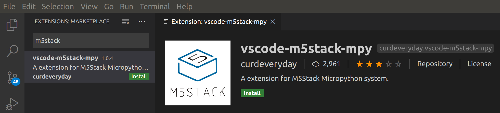
>
>PlatformIO propose aussi un environnement de développement basé sur Visual Studio Code. Toute la documentation est disonible sur le site ci-dessous :
> https://www.programmez.com/magazine/article/decouverte-du-m5stack