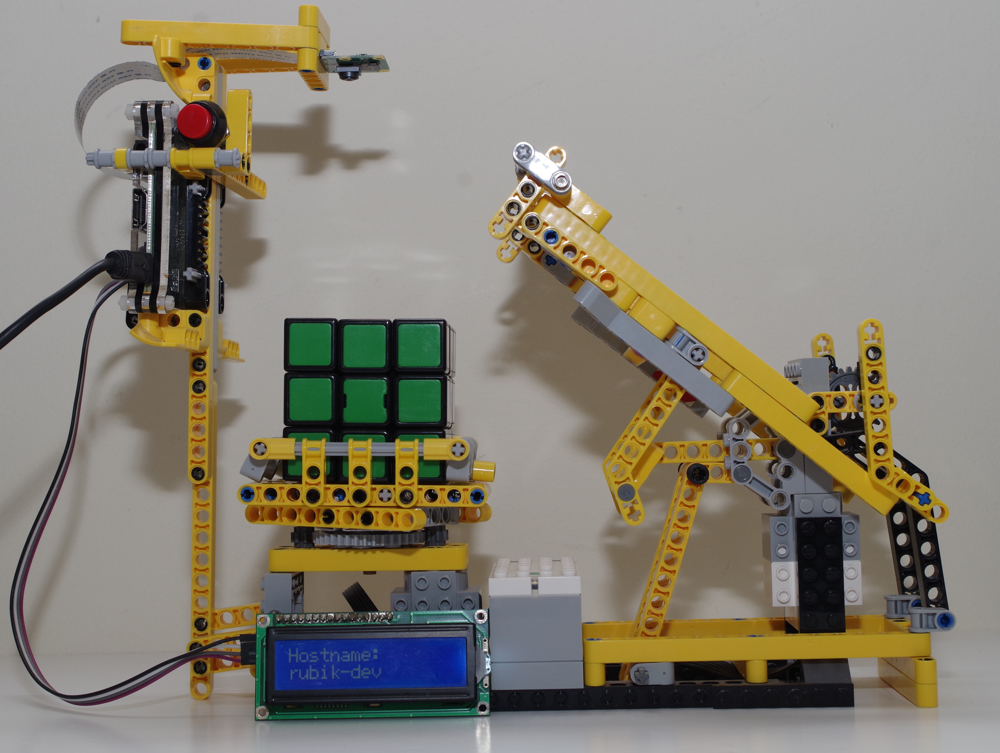
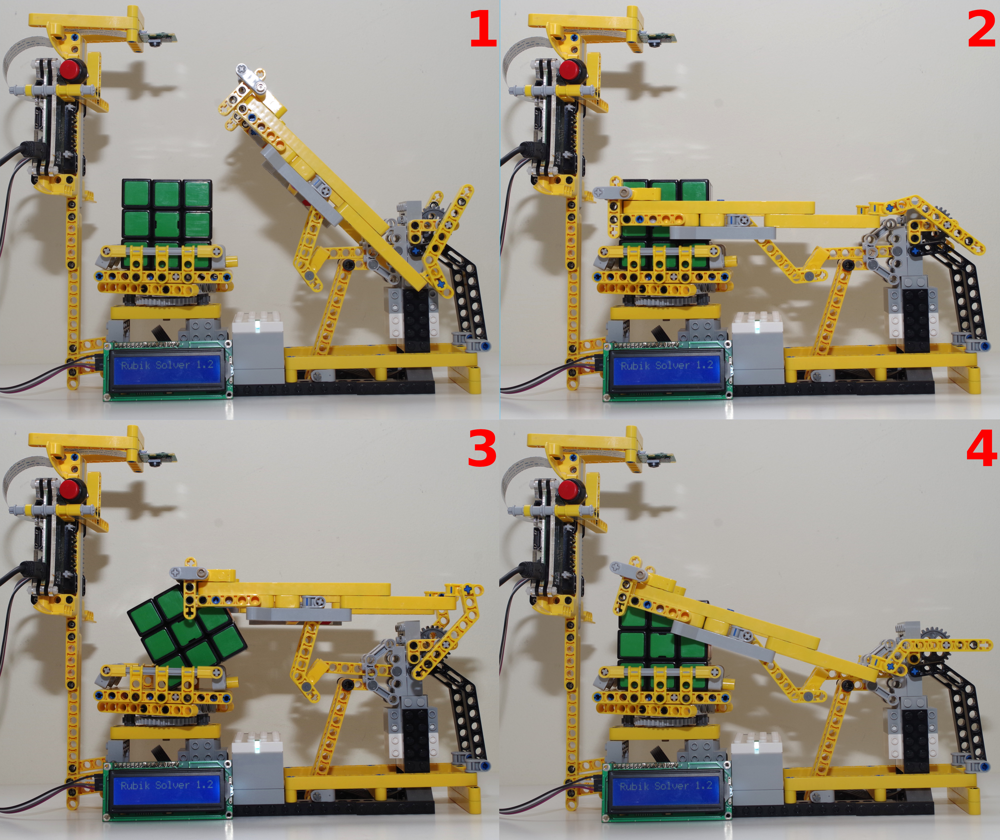
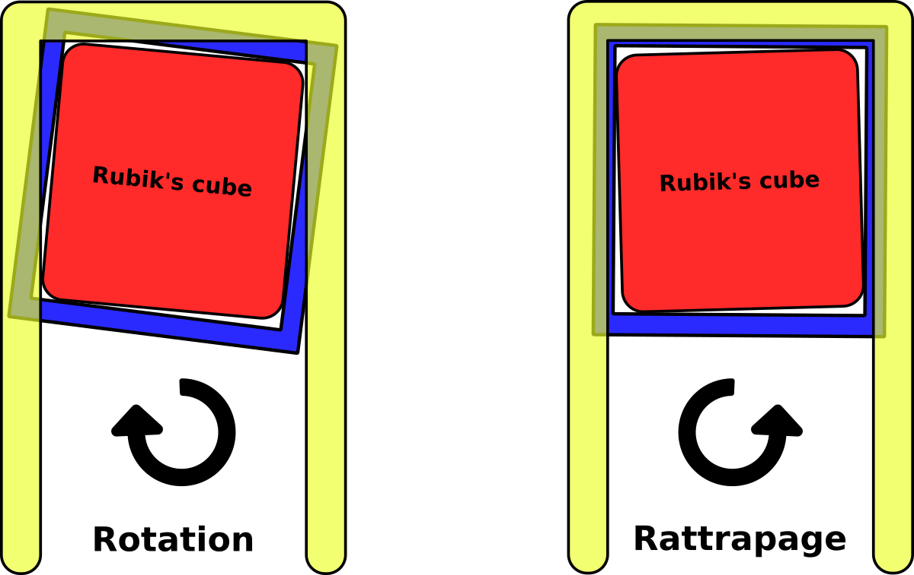
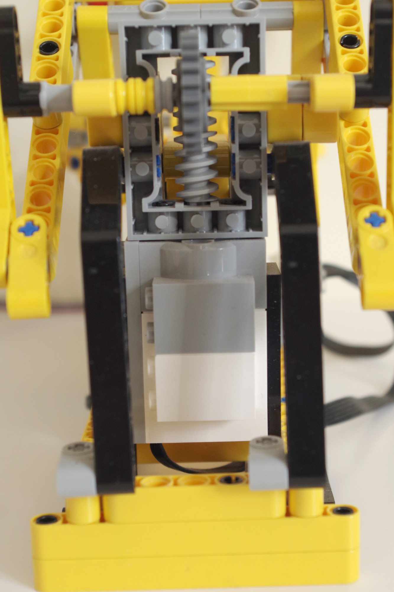
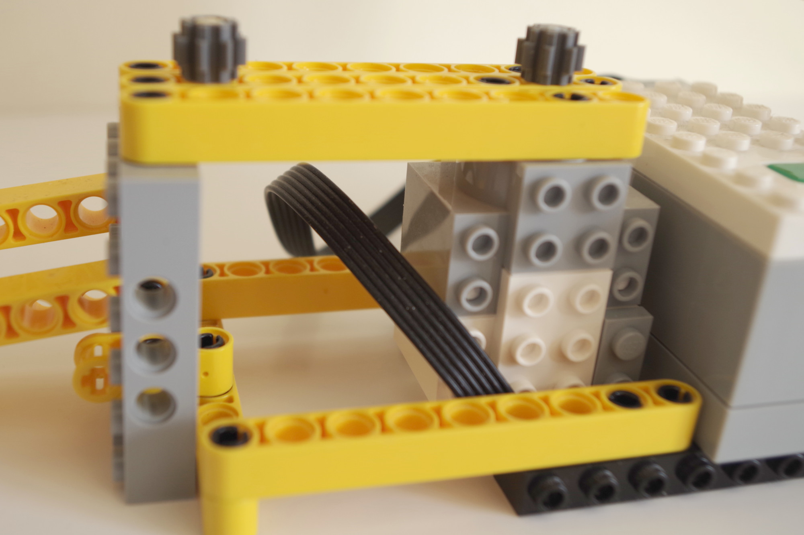
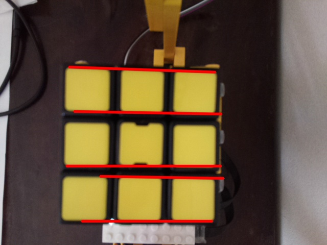

# DIY : un robot pour résoudre votre Rubik’s Cube

_Sébastien Colas_

Je suis formateur en informatique depuis bientôt 20 ans. Au cours de ma carrière j’ai pu dispenser des cours sur de nombreuses technologies : Serveur d’applications JavaEE, SOA, Services Web, Linux, Virtualisation, API led Connectivty et Application Network. Sans oublier les langages : Java, PHP, Python, JavaScript... Je suis aussi auteur pour « Linux Pratique » et « Hackable » autour des sujets Raspberry Pi, Arduino, IoT, électronique digitale et bien sûr Linux.
http://colas.sebastien.free.fr/



## Introduction

Vous possédez peut-être un Rubik's cube que vous n'avez jamais réussi à résoudre. Dans cet article nous allons construire un robot à base de Lego et de Raspberry Pi. Il va résoudre le problème pour nous. Nous commencerons par l'expression des besoins en rédigeant un mini cahier des charges, nous aborderons ensuite l'aspect matériel et nous finirons bien sûr par la programmation.

## 1. Cahier des Charges
Nous allons créer un robot Lego qui va résoudre automatiquement un Rubik's Cube. Il nous faudra donc:
- des Legos Technic
- des Legos PoweredUp
- un écran LCD
- une caméra
- un Rapsberry Pi

Pour la programmation du robot, nous coderons en Python 3, un langage fréquemment utilisé sur le Raspberry Pi.  Nous développerons en utilisant VSCode sur un PC fonctionnant sur Ubuntu ou Windows. Le plugin Visual Studio Code Remote – SSH, nous permettra d’éditer et d’exécuter le programme se trouvant sur notre Raspberry Pi. Toutes les informations concernant l’installation et le fonctionnement du plugin se trouvent sur le site officiel :

https://code.visualstudio.com/docs/remote/ssh

### 1.1 Étapes du programme

Voici les différentes étapes du programme:
1. Connexion au Lego Powered Hub
2. Étalonnage du panier permettant la rotation du cube
3. Lecture des 6 faces du cube et remise à la position de départ du robot
4. Décodage et résolution du cube via des programmes externes et bibliothèques
5. Résolution du cube grâce au robot

### 1.2 Étapes du robot



Voici les différentes positions du bras du robot permettant le retournement du cube ainsi que le blocage pour effectuer un mouvement de résolution du cube:
- Position de départ/fin (photo de l'article)
- Position 1: cube débloqué
- Position 2: cube bloqué pour effectuer un mouvement de rotation
- Position 3: cube à 3/4 retourné
- Position 4: cube retourné complètement



Pour une manipulation du cube, il faudra donc le bloquer (position 2 du bras) et effectuer une rotation du panier. Malheureusement le panier étant plus grand que le cube pour permettre son retournement, il va donc falloir faire 2 rotations :
- Rotation 1 : manipulation le cube (environ 45)
- Rotation 2 : remise du panier dans l’axe (pour un futur retournement du cube)

## 2. Le matériel (hardware)

Voici le matériel qui a été retenu.

### 2.1 Un Rubik’s Cube

Le choix du Rubik’s Cube s’est porté sur un modèle d’entraînement où la manipulation du cube n’implique que peu de contraintes, ceci dans le but de ne pas trop solliciter les moteurs Lego.

### 2.2 Des Lego




Tout d’abord il va falloir un certain nombre de Lego pour construire notre robot. Inutile de réinventer la roue, un certain nombre de modèles existe déjà sur le site https://www.mindcuber.com/. Malheureusement, rien concernant les Lego PoweredUp. Notre robot sera donc librement inspiré des modèles de MindCuber.

Pour les Legos PoweredUP voici les composants retenus :
- Le Hub 88009 permettant le pilotage de moteurs via Bluetooth
- 2 moteurs moyens 88008 offrant un pilotage précis du moteur. Ces moteurs sont comparables à des servomoteurs.

Sur MecaBricks vous pourrez trouver la modélisation du robot :
https://mecabricks.com/en/models/9P2k1Aoevon

_Malheuresement les moteurs 88008 ne sont pas encore disponibles sur le site MecaBricks. Vous pouvez vous référer aux photos pour les mettre en place._

### 2.3 Raspberry PI

N’importe quel modèle fera l’affaire du moment que le modèle possède le Bluetooth ainsi que le connecteur pour la PiCamera. Nous utilisons un Raspberry Pi 3 Model A+.

### 2.4 Pi Camera

La version 1 est beaucoup trop sensible aux variations de lumière, rendant la détection des faces de notre Rubik’s Cube difficile à réaliser. Nous partirons donc sur une Pi Camera version 2.

### 2.5 Un afficheur LCD piloté par I2C

Pour avoir un affichage de la progression, nous pouvons rajouter un écran LCD pilotable par I2C. Nous utiliserons ici le matériel suivant :
- LCD IIC Interface Converter Board
- Écran LCD 16x2 rétroéclairé bleu

## 3. La programmation : fonctions de base
Nous supposerons que vous avez téléchargé et installé le système Raspberry Pi OS (anciennement Raspbian). Pensez à faire un update avant de passer à la suite.
Activez la PiCamera et l’I2C via raspi-config. 

Le programme complet est disponible ici:
https://github.com/colas-sebastien/rpi-rubik

Dans cet article nous allons commenter les points principaux.

### 3.1 Prérequis

Un certain nombre de logiciels et de bibliothèques sont nécessaires à la réalisation de notre projet: OpenCV, BrickNil, LCDDriver, PiCamera, Kociemba, rubiks-cube-tracker, rubiks-color-resolver.

Les 2 projets rubiks-cube-tracker et rubiks-color-resolver nous permettrons de décoder notre cube à l'aide des photos des 6 faces. L'algorithme Kociemba nous permettra de calculer les mouvements à effectuer pour résoudre le cube.

Pour installer l’ensemble des outils, en SSH ou directement sur le Terminal, tapez les commandes suivantes :
```
sudo apt-get update 
sudo apt-get upgrade
sudo apt-get install python3-opencv python3-pip git python3-smbus python3-picamera python-pip python-opencv
sudo pip3 install bricknil kociemba
sudo pip install git+https://github.com/dwalton76/rubiks-cube-tracker.git
sudo pip3 install git+https://github.com/dwalton76/rubiks-color-resolver.git
git clone https://github.com/the-raspberry-pi-guy/lcd
sudo lcd/install.sh
```

### 3.2 Initialisation des composants
```
display = drivers.Lcd()
camera = PiCamera()
```

Ces deux commandes nous permettent d’initialiser la PiCamera ainsi que le LCD.

### 3.3 Utilisation de BrickNil
```
@attach(ExternalMotor, name='retourne',port=0, capabilities=['sense_speed'])
@attach(ExternalMotor, name='rotation',port=1, capabilities=['sense_speed'])
class Rubik(PoweredUpHub):
```

Le programme principal est la classe python **Rubik** de type **PoweredUp**. Les ports 0 et 1 correspondent respectivement aux ports A et B sur le Hub Lego. Sur le port 0 le moteur sera nommé **retourne**. Sur le port 1, le moteur sera nommé **rotation**. On notera bien qu’il s’agit de moteur de type **ExternalMotor** et qu’il s’agit de moteurs intelligents avec capteurs de vitesse: **sense_speed**.

BrickNil nous permet de contrôler les moteurs de façon asynchrone, de manière à pouvoir donner des ordres en même temps aux différents moteurs. Malheureusement dans notre cas, nous souhaitons effectuer les mouvements en séquence, c’est-à-dire de façon synchrone. Il va donc falloir créer des fonctions pour attendre que les moteurs finissent leurs mouvements. 

```
async def retourne_change(self):
  self.retourne_vitesse=self.retourne.value[ExternalMotor.capability.sense_speed]

async def attente_retourne(self):
  await sleep(0.5)
  while (self.retourne_vitesse != 0) :
    await sleep(0.1)
```

La première fonction est une fonction de CallBack (fonction automatiquement appelée par BrickNil quand la vitesse du moteur change). Cette fonction positionnera la variable **retourne_vitesse** à la vitesse courante. Il suffira d’attendre que la vitesse soit à zéro pour détecter la fin du mouvement, c’est l’objet de la fonction **attente_retourne**.

### 3.4 fonctions de mouvement
À l’aide des fonctions précédentes, nous pouvons maintenant créer des fonctions pour les mouvements permettant de manipuler le cube. Nous allons en profiter pour leur donner un code.

Fonctions de rotation du panier :

| Code | Nom de la fonction |
| ---- | ------------------ |
| 0    | tourne_gauche      |
| 1    | manipule_gauche    |
| 2    | manipule_gauche_2  |
| 3    | tourne_droite      |
| 4    | manipule_droite    |
| 5    | tourne_gauche_2    |

Fonctions de manipulation du bras :

| Code | Nom de la fonction    |
| ---- | --------------------- |
| a    | position_debut        |
| b    | position_bloque       |
| B    | position_debloque     |
| c    | position_retourne     |
| C    | position_fin_retourne |

## 4. La programmation: algorithme

Nous pouvons maintenant nous attaquer à l'intelligence de notre robot.

### 4.1 Étalonnage du panier
Notre robot dispose donc de 2 mouvements : le déplacement du bras et la rotation du panier.

Le déplacement du bras ne nécessite pas un calibrage fin. On peut donc supposer que la position de départ est toujours bonne. Il ne faudra pas oublier de repositionner le bras à la fin du programme.

La position du panier est par contre critique pour pouvoir convenablement manipuler le cube. Nous procéderons donc à un étalonnage pour nous assurer que le panier se trouve dans la bonne position avant toute manipulation.




La fonction correction_rotation nous permettra de calculer l’angle de correction pour l’étalonnage. Voici les grandes étapes :
- Capture de l’image et détection des segments de plus d’une certaine longueur à l’aide d’OpenCV
- Calcul de l’angle de chacun des segments à l’aide de la fonction arc tangente
- Si l’angle des segments est inférieur à 45° (PI/4), on l’ajoute à la liste des segments retenus
- à l’aide d’un tableau associatif, on cherche l’angle qui apparaît le plus
- on retourne l’angle ainsi trouvé

### 4.2 Lecture du cube

```
async def lecture_cube(self):
  # FACE 1 (devant)
  display.lcd_display_string("Photo 1/6 F", 2) 
  rawCapture=PiRGBArray(camera)
  camera.capture(rawCapture,format='bgr')
  image=rawCapture.array
  cv2.imwrite('images/rubiks-side-F.png',image)
  await self.retourne_rubik()
```

Regardons les étapes de la lecture de la première face de notre cube (appelée F pour Front) :
1. Affichage LCD
2. Photo à l’aide de PiCamera
3. Écriture de la photo sur disque
4. Mouvement pour obtenir la face suivante

Il faudra répéter l’opération pour les différentes faces : F,U,R,B,D,L (Front, Up, Right, Back, Down, Left)

### 4.3 Décodage et résolution du cube
Le décodage du cube sera assuré par des programmes externes. Le but du décodage étant de trouver les 9 couleurs que comportent les 6 faces de notre cube. Nous utiliserons 2 fonctions :
- **decode_cube** : fonction créant un fichier tracker.json à l’aide de photos
- **resolution_cube** : fonction créant une représentation informatique de notre cube à l’aide du fichier **tracker.json**

À la fin the la fonction resolution cube on appelle l’algorithme de résolution Kociemba :
```
self.mouvements=kociemba.solve(self.cube)
```
Les mouvements de résolution sont composés d’une lettre F,U,R,B,D,L (Front, Up, Right, Back, Down, Left) ainsi qu’un paramètre optionnel : l’apostrophe pour une rotation en sens inverse, 2 pour une double rotation.

### 4.4 Prise en compte des contraintes techniques
La manière dont a été créé notre robot ne nous permet que les actions B. Il va donc falloir convertir toutes les autres actions pour obtenir des actions B. Transformons nos actions Rubik’s cube en actions réalisables par nos fonctions précédemment développées :

| Mouvement | Fonctions associées    |
| --------- | ---------------------- |
| B         | b1B                    |
| B'        | b4B                    |
| B2        | b2B                    |
| D         | cCb1cCcCcC             |
| D'        | cCb4cCcCcC             |
| D2        | cCb2cCcCcC             |
| F         | cCcCb1cCcC             |
| F’        | cCcCb4cCcC             |
| F2        | cCcCb2cCcC             |
| R         | B3cCb1cCcCcCB0         |
| R’        | B3cCb4cCcCcCB0         |
| R2        | B3cCb2cCcCcCB0         |
| L         | B0cCb1cCcCcCB3         |
| L’        | B0cCb4cCcCcCB3         |
| L2        | B0cCb2cCcCcCB3         |
| U         | cCcCcCb1cC             |
| U’        | cCcCcCb4cC             |
| U2        | cCcCcCb2cC             |

### 4.5 Optimisations

Si pour résoudre un cube on doit faire les mouvements F puis U (il s’agit ici d’un exemple), cela se traduira à l’aide de nos fonctions : cCcCb1cCcCcCcCcCb1cC, hors cCcCcCcC consite à retourner 4 fois le cube, donc ne rien faire. On peut alors simplifier cCcCb1cCcCcCcCcCb1cC en cCcCb1cCb1cC. Ainsi, nous réduirons grandement le nombre de mouvements de notre robot.

De plus il est plus rapide de faire 2 rotations et 1 retournement plutôt que 3 retournements on peut donc remplacer : cCcCcC par B5cB5

## Conclusion

Nous disposons désormais d'un robot résolvant à notre place un Rubik's Cube.
De nombreux tests ont bien sûr été réalisés avant d'aboutir à un résultat. Lors de votre propre réalisation, il faudra très probablement revoir toutes les constantes de positions avant d'obtenir un robot fonctionnel.

Pour aller plus loin, on pourra:
- améliorer la partie robotique pour accélérer les mouvements
- voir si d'autres optimisations de mouvement sont possibles
- ajouter à bouton pour démarrer automatiquement la robotique
- lancer automatiquement le programme au démarrage du Raspberry.

Une petite vidéo du résultat final est disponible si dessous :
https://youtu.be/aUNgpjnszOo