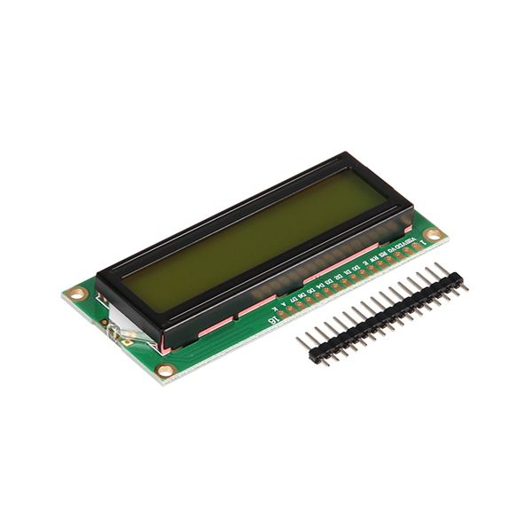
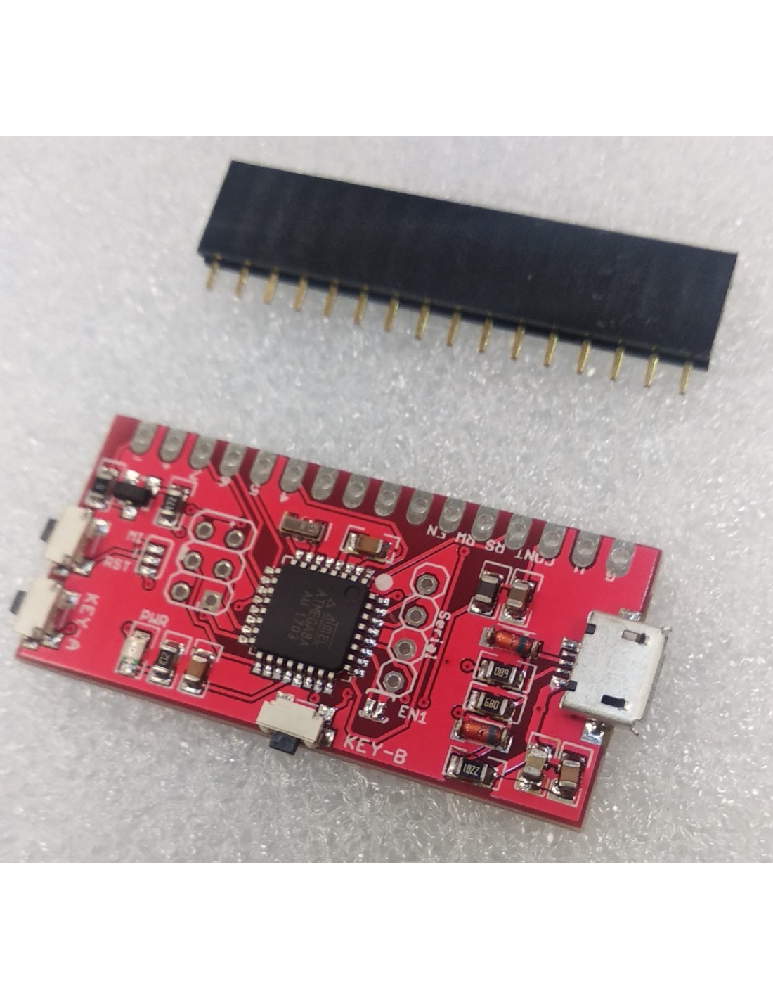
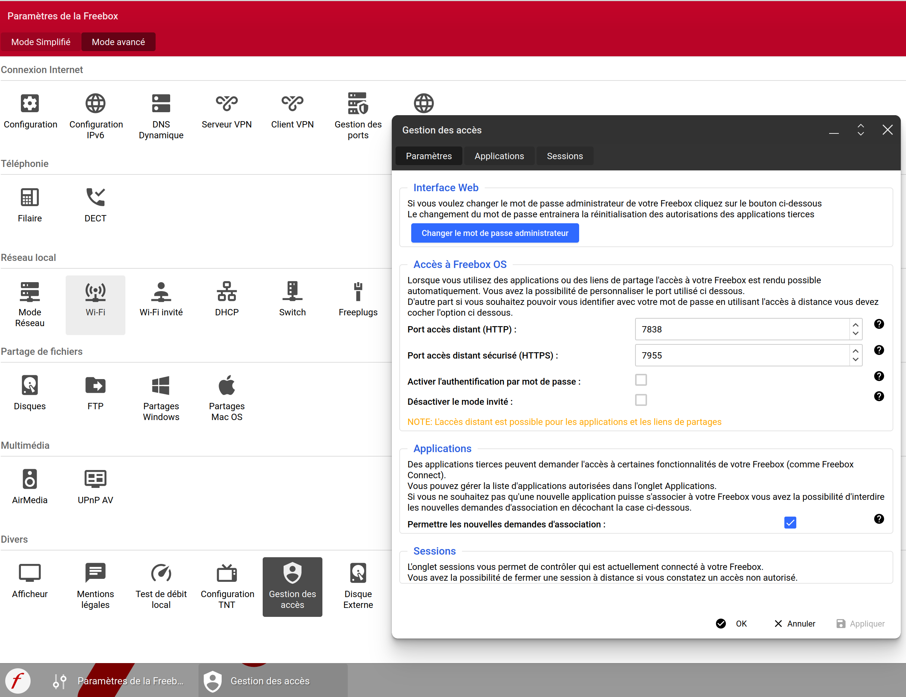
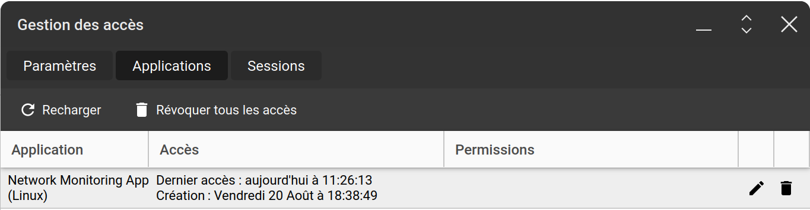

# Superviser votre Linux à l’aide d’un écran LCD

_Sébastien Colas_

Je suis formateur en informatique depuis bientôt 20 ans. Au cours de ma carrière j’ai pu dispenser des cours sur de nombreuses technologies : Serveur d’applications JavaEE, SOA, Services Web, Linux, Virtualisation, API led Connectivty et Application Network. Sans oublier les langages : Java, PHP, Python, JavaScript... Je suis aussi auteur pour « Linux Pratique » et « Hackable » autour des sujets Raspberry Pi, Arduino, IoT, électronique digitale et bien sûr Linux.
http://colas.sebastien.free.fr/


## Introduction

Il peut s’avérer utile de pouvoir accéder à des informations de votre système Linux sans avoir à changer de fenêtre surtout si par exemple vous êtes dans une partie de jeu vidéo. Dans cette article je vous propose donc dans un premier temps de réaliser un montage électronique très simple permettant l’affichage de tout type d’information sur un écran LCD 16x2 caractères. Ensuite nous utiliserons **lcd4linux** pour afficher les données qui nous intéressent.

## 1. Hardware
Voici les différents composants qui composeront notre projet :
- écran LCD 16x2 caractères
- 1602 LCD USB Mini Drive Board
- cordon USB vers micro-USB




L’assemblage de l’écran LCD vers le convertisseur USB est extrêmement simple, à chaque PIN de l’écran LCD correspond une PIN du convertisseur USB.

Le gros avantage de ce montage est que l’on pourra au choix :
- déporter l’affichage sur le bureau à l’aide du cordon USB
- Intégrer l’afficheur directement à la tour de son PC

On pourra aussi opter pour un écran LCD retro-éclairé de couleur.

## 2. Software
Il existe différentes manière de contrôler notre écran LCD, ici comme nous voulons principalement afficher des informations systèmes en temps réel nous allons utiliser lcd4linux.

Par chance le programme existe sur la plupart des distributions. Sous Ubuntu l’installation est très simple :
```
sudo apt-get update -y
sudo apt-get install -y lcd4linux
```

Lors de l’installation un fichier de configuration a été créé pour nous **/etc/lcd4linux.conf**. A des fins didactiques nous allons créer nous même le fichier à partir de zéro. Le but étant de couvrir les principales fonctionnalités de **lcd4linux**. Pour ce faire nous allons afficher :
- Un simple texte 
- La date et l’heure
- L’utilisation du CPU 
- La température extérieure stockée dans une base MySQL accessible dans notre réseau local
- La bande passante en upload et en download de notre Freebox à l’aide d’un script shell

### 2.1 Affichage d’un texte
Pour commencer créons quelques variables dans notre fichier **/etc/lcd4linux.conf**. Je rappelle que la modification du fichier doit se faire en tant que root :
```
Variables {
   seconde     1000
   five_secs   5000
   minute     60000
}
```

Comme on peut le constaté l’unité de base est la milliseconde, d’où la définition de variables pour plus de simplicité.
Définissons maintenant la configuration de notre afficheur :
```
Display LCD2USB {
    Driver    'LCD2USB'
    Size      '16x2'
    Backlight 0
    Icons     1
}
```

En l’occurrence nous avons un composant LCD2USB avec un afficheur LCD 16x2 caractères sans rétro-éclairage. On active aussi la possibilité de se créer nos propres icônes.
Une fois défini il faut demander à LCD4Linux d’utiliser le display :
Display 'LCD2USB'

Maintenant nous allons devoir définir ce que nous voulons afficher, cela se fait à l’aide de composant appelé Widgets :
```
Widget Hello {
    class 'Text'
    expression 'Hello LCD'
    width 9
}
```

Ici note Widget texte affichera « Hello LCD ». La longueur du texte affiché est importante. Cette longueur sera essentielle quand on voudra aligner du texte à droite par exemple.
Nous allons maintenant pouvoir positionner notre Widget au sein d’un Layout :
```
Layout MyLayout {
    Row1 {
        Col1 'Hello'
    }
    Row2 {
        Col2 'Hello'
    }
}
```

Un Layout se compose donc de lignes (row) et de colonnes (Col) sur lesquels on va pouvoir afficher des Widgets. Notre texte sera donc affiché sur la première colonne de la première ligne et la deuxième colonne de la deuxième ligne.
Notre fichier de configuration étant complété il ne nous reste plus qu’à tester le résultat en redémarrant le service :
```
systemctl restart lcd4linux
```

NB : Par la suite il faudra exécuter à nouveau la commande pour tenir compte de chaque modification.

### 2.2 Affichage de la date et l’heure
Nous allons afficher la date et l’heure sur les dernières colonnes de nos 2 lignes d’écran LCD. Il faut donc créer 2 Widgets : une pour la date et une pour l’heure :
```
Widget Date {
    class 'Text'
    expression strftime('%d/%m',time())
    width 5
    align 'L'
    update minute
}

Widget Time {
    class 'Text'
    expression strftime('%H:%M',time())
    width 5
    align 'L'
    update second
}
```

Nous définissons donc pour chaque Widget le fait que nous allons afficher du texte de longueur 5, qu’il faudra aligner le texte à gauche (L : Left) et qu’il faudra mettre à jour l’information toutes les minutes pour la date et toutes les seconde pour l’heure. Le plus important est ce que nous voulons afficher c’est à dire l’**expression**. LCD4Linux nous permet d’utiliser la fonction **strftime()** pour afficher la date courante **time()** avec un format spécifique. **'%d/%m'** pour la date et **'%H:%M'** pour l’heure.
Mettons à jour notre Layout :
```
Layout MyLayout {
    Row1 {
        Col12 'Date'
    }
    Row2 {
        Col12 'Time'
    }
}
```

### 2.3 Affichage de l’utilisation du CPU
L’utilisation du CPU sur notre machine est aussi une information importante, nous allons afficher cette information au début de la première ligne. Comme précédemment il va nous falloir ajouter un Widget qui sera ensuite intégrer à notre Layout :
```
Widget Busy {
    class 'Text'
    expression proc_stat::cpu('busy', second)
    postfix '%'
    width 5
    precision 0
    align 'R'
    update second
}
Layout MyLayout {
    Row1 {
        Col1 'Busy'
        Col12 'Date'
    }
    Row2 {
        Col12 'Time'
    }
}
```

Concentrons nous sur les paramètres importants du Widget. Nous utilisons **postfix** pour afficher le caractère **%** après la consommation de notre CPU. Nous alignons notre texte à droite et nous ne voulons aucun chiffre après la virgule : **precision 0**. L’expression nous permet de récupérer l’utilisation du CPU avec une périodicité de 1 second.

### 2.4 Affichage de la température extérieure
L’accès aux données systèmes local s’avère donc simple. Interressons nous maintenant a une source de donnée distante. Nous voulons connaître la température extérieure. Dans notre exemple le relevé de température est stocké dans une base de donnée MySQL accessible depuis le réseau local.
LCD4Linux propose la connexion à une base de donnée MySQL sous forme d’un plugin, il suffit donc de le configurer pour avoir l’accès à la base de données :

```
Plugin MySQL {
    server 'meteo.local'
    port 3306
    user 'user'
    password 'password'
    database 'meteo'
}

Une fois l’accès à base configuré, nous pouvons créer un nouveau Widget qui contiendra la requête SQL d’accès au données :
Widget MySQLTemp {
    class 'Text'
    expression MySQL::query('SELECT temperature FROM meteo.sensor_data WHERE sensor_id=1 order by date DESC limit 1;')
    width 4
    update minute
}
```

Malheureusement le symbole degré n’est pas supporté par **lcd4Linux**, il est donc impossible d’utiliser **postfix** dans le **widget** comme nous l’avons fait précédemment. Nous allons donc créer à la main notre symbole degré dans un nouveau **widget**. Attention celui-ci aura pour classe **Icon** :
```
Widget Degree {
    class 'Icon'
    Bitmap {
        Row1 '.**..'
        Row2 '*..*.'
        Row3 '*..*.'
        Row4 '.**..'
        Row5 '.....'
        Row6 '.....'
        Row7 '.....'
        Row8 '.....'
    }
}
```

Il en nou reste plus qu’à afficher nos deux widgets au début de la seconde ligne :
```
Layout MyLayout {
    Row1 {
        Col1 'Busy'
        Col12 'Date'
    }
    Row2 {
        Col1 'MySQLTemp'
        Col5 'Degree'
        Col12 'Time'
    }
}
```

### 2.5 Affichage d’informations réseau issues d’une Freebox
La dernière chose que nous voulons afficher sur notre écran est l’état de notre réseau. Il est bien sûr très facile de récupérer les informations de notre Linux en terme de débit réseau mais sur un réseau local il est plus utile d’avoir une idée des débits réseau internet au niveau de la box internet elle-même. Ici nous allons récupérer ces informations d’une Freebox car Free met à disposition une API de contrôle et supervision : https://dev.freebox.fr/sdk/os/#

#### 2.5.1 création des scripts de supervision
Inutile de ré-inventer la roue, on trouve facilement sur GitHub du code prêt à l’emploi pour simplifier l’accès à l’API Free. Ici nous allons récupérer les information grâce à un script shell :
```
git clone https://github.com/JrCs/freeboxos-bash-api.git
```
Avant de pouvoir utiliser le script shell, il faut tout d’abord s’assurer que la Freebox accepte de nouvelles demandes d’association d’application. Il faut donc se connecter sur l’interface de la Freebox via l’url http://mafreebox.freebox.fr 

Il faudra cliquer sur **Paramètre de la Freebox**, ensuite sélectionner le **mode avancé** et cliquer sur **Gestion des accès**. Ensuite dans le cadre **Application** il faudra bien vérifier que la case **permettre les nouvelles demandes d’association** est cochée. Pour des raisons de sécurité, une fois notre application enregistrée, il est fortement conseillé de décocher la case.



Enregistrons notre application pour obtenir un jeton d’accès :
```
cd freeboxos-bash-api
source ./freeboxos_bash_api.sh
authorize_application  'NetworkMonitoring.app'  'Network Monitoring Application' '1.0.0'  'Linux'
```

Il faudra ensuite confirmer la création du jeton en appuyant sur le bouton OK de la Freebox.
Récupérons le jetons que nous allons utiliser par la suite :
```
MY_APP_ID="NetworkMonitoring.app"
MY_APP_TOKEN="4uZTLOMwSyiPB426tSCWLpSSZ6bXIY+i+d+F32tVMx2j1p8o"
```

Dans le menu gestion des accès de la Freebox notre application doit apparaître.



Nous pouvons désormais écrire un script pour accéder au débit internet en download. Ici l’unité sera exprimé en Mo/s : **rate_down.sh**
```
#!/bin/bash
MY_APP_ID="NetworkMonitoring.app"
MY_APP_TOKEN="4uZTLOMwSyiPB426tSCWLpSSZ6bXIY+i+d+F32tVMx2j1p8o"
. /home/seb/freeboxos-bash-api/freeboxos_bash_api.sh
login_freebox "$MY_APP_ID" "$MY_APP_TOKEN"
answer=$(call_freebox_api '/connection/')
rate_down=$(get_json_value_for_key "$answer" 'result.rate_down')
echo "$rate_down 1048576" | awk '{printf "%.1f", $1 / $2}' | tr , .
```

De même le script pour l’updload, ici l’unité sera exprimé en ko/s : **rate_up.sh**
```
#!/bin/bash
MY_APP_ID="NetworkMonitoring.app"
MY_APP_TOKEN="4uZTLOMwSyiPB426tSCWLpSSZ6bXIY+i+d+F32tVMx2j1p8o"
. /home/seb/freeboxos-bash-api/freeboxos_bash_api.sh
login_freebox "$MY_APP_ID" "$MY_APP_TOKEN"
answer=$(call_freebox_api '/connection/')
rate_up=$(get_json_value_for_key "$answer" 'result.rate_up')
echo "$rate_up 1024" | awk '{printf "%d", $1 / $2}' | tr , .
```

#### 2.5.2 Affichage des données
Une fois les scripts prêts, il ne reste plus qu’a créer un Widget pour eux et de mettre à jour notre Layout.
```
Widget DownRate {
    class 'Text'
    expression exec('/home/seb/freeboxos-bash-api/rate_down.sh', five_secs)
    prefix 'D'
    width 4
    align 'R'
    update five_secs
}

Widget UpRate {
    class 'Text'
    expression exec('/home/seb/freeboxos-bash-api/rate_up.sh', five_secs)
    prefix 'U'
    width 4
    align 'R'
    update five_secs
}

Layout MyLayout {
    Row1 {
        Col1 'Busy'
        Col7 'UpRate'
        Col12 'Date'
    }
    Row2 {
        Col1 'MySQLTemp'
        Col5 'Degree'
        Col7 'DownRate'
        Col12 'Time'
    }
}
```

## Conclusion
Nous avons vu dans cette article que grâce à LCD4Linux nous pouvons afficher facilement tout type de donner sur un écran LCD connecté en USB.
Voici quelques idées pour aller plus loin :
- Remplacer LCD4Linux par LCDProc
- créer un programme Python pour piloter l’écran LCD
- Déporter les boutons Key-A et Key-B pour une utilisation plus simple et bien sûr associer une fonction à chacun de ces boutons
- Câbler le Reset sur un bouton, en effet parfois le LCD2USB ne démarre pas correctement
- démarrer/redémarrer LCD4Linux lorsque l’on branche ou rebranche l’écran LCD grâce à udev 
